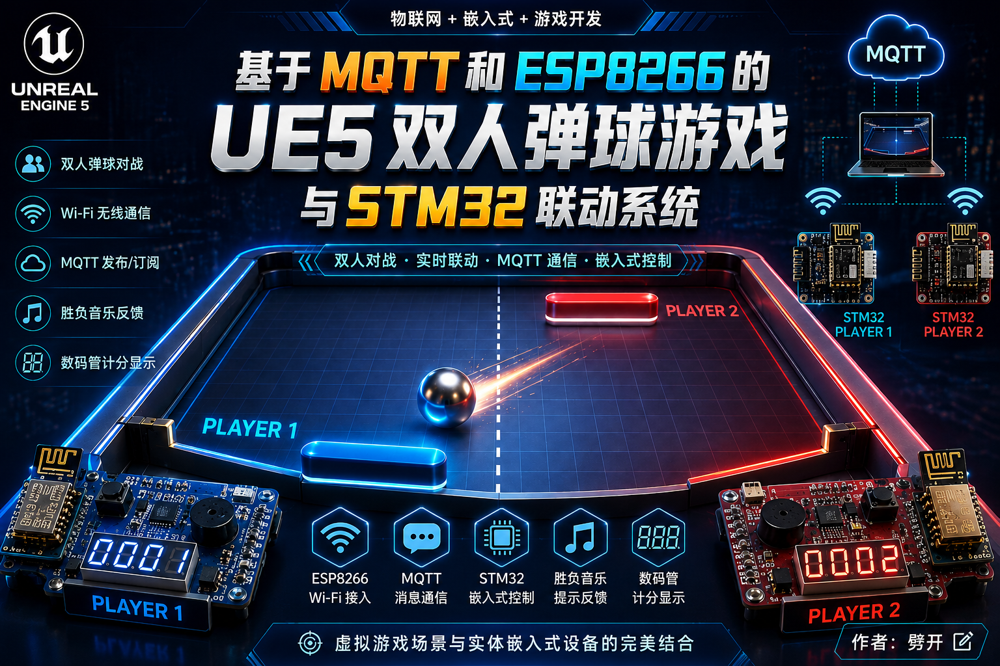

# FinalAssignment

嵌入式期末作业：基于 MQTT 的 UE5 双人弹球游戏与 STM32 控制器联动。



## 项目简介

本项目将 STM32 嵌入式控制器、MQTT 通信和 Unreal Engine 5 游戏端结合，实现通过实体按键/控制器操作 UE5 双人 Pong 游戏的交互效果。

## 项目展示

本项目围绕 “实体 STM32 控制器 + MQTT 消息通信 + UE5 双人弹球游戏” 展开，展示内容包括 Wi-Fi 接入、MQTT 发布/订阅、双玩家输入控制、胜负音效反馈和数码管计分显示。

## 视频展示

[嵌入式期末作业视频展示](https://www.bilibili.com/video/BV18ULD6iEjP?vd_source=e03c2edd09090734ede0815cdc202303)

## 目录结构

- `01_UE_Project/`：UE5 工程源码
- `02_UE_Package/`：Windows 打包版本
- `03_STM32_Project/`：STM32 控制端工程

## 克隆到本地

本仓库使用 Git LFS 管理 UE 资源和打包文件。不要直接使用 GitHub 网页的 `Download ZIP`，否则 `.exe`、`.ucas`、`.pak` 等大文件可能会变成 LFS 指针文件，导致游戏无法运行。

Windows PowerShell 中执行：

```powershell
cd C:\Users\你的用户名
git clone https://github.com/pikai-pk/STM32Assignment.git
cd STM32Assignment
git lfs install
git lfs pull
```

如果网络不稳定，可以先设置 Git 使用 HTTP/1.1 后再克隆：

```powershell
git config --global http.version HTTP/1.1
git config --global http.postBuffer 524288000
cd C:\Users\你的用户名
git clone --depth 1 https://github.com/pikai-pk/STM32Assignment.git
cd STM32Assignment
git lfs install
git lfs pull
```

克隆完成后运行游戏：

```text
02_UE_Package\Windows\PongMQTT.exe
```

请保持整个 `02_UE_Package\Windows` 文件夹完整，不要只复制或只运行单独的 `PongMQTT.exe`。真正的游戏程序、资源包和运行库在旁边的 `Engine`、`PongMQTT\Binaries`、`PongMQTT\Content\Paks` 等目录中。

可以用下面命令检查大文件是否拉取成功：

```powershell
dir .\02_UE_Package\Windows\PongMQTT.exe
dir .\02_UE_Package\Windows\PongMQTT\Binaries\Win64\PongMQTT.exe
dir .\02_UE_Package\Windows\PongMQTT\Content\Paks\PongMQTT-Windows.ucas
```

其中内部真正的 `PongMQTT\Binaries\Win64\PongMQTT.exe` 和 `PongMQTT-Windows.ucas` 应该是几十 MB 到几百 MB。如果只有 1KB 左右，说明 Git LFS 没有拉取成功，需要重新执行：

```powershell
git lfs pull
```

## STM32 端配置修改

STM32 控制端的 Wi-Fi、MQTT 和玩家编号配置集中在：

`03_STM32_Project/PongCtrl/myDrivers/app_config.h`

一般只需要修改这个文件，不需要改 `bsp_esp8266.c` 或 `mqtt_client.c`。

### 连接自己的热点

如果要让 STM32 连接自己的手机热点、电脑热点或路由器 Wi-Fi，修改下面两行：

```c
#define WIFI_SSID                 "你的热点名称"
#define WIFI_PASSWORD             "你的热点密码"
```

例如手机热点名称是 `MyPhone`，密码是 `12345678`：

```c
#define WIFI_SSID                 "MyPhone"
#define WIFI_PASSWORD             "12345678"
```

注意事项：

- ESP8266 通常只支持 2.4GHz Wi-Fi，手机热点建议开启 2.4GHz 或“兼容模式”。
- 热点名称和密码要区分大小写。
- 如果密码为空，需要确认 ESP8266 AT 固件是否支持空密码热点。

### 修改 MQTT 服务器地址

MQTT Broker 地址同样在 `app_config.h` 中修改：

```c
#define MQTT_BROKER_HOST          "192.168.137.1"
#define MQTT_BROKER_PORT          1883
```

`MQTT_BROKER_HOST` 要填写 MQTT 服务器在局域网里的真实 IP，不能写 `127.0.0.1`。`127.0.0.1` 只代表 STM32/ESP8266 自己，不代表电脑。

如果 MQTT Broker 运行在电脑上，操作步骤是：

1. 让电脑和 STM32 连接到同一个热点或同一个路由器。
2. 在电脑上打开命令行，执行 `ipconfig`。
3. 找到当前网络的 IPv4 地址，例如 `192.168.137.1` 或 `192.168.1.23`。
4. 把这个地址填入 `MQTT_BROKER_HOST`。

示例：

```c
#define MQTT_BROKER_HOST          "192.168.1.23"
#define MQTT_BROKER_PORT          1883
```

如果使用云服务器或局域网 MQTT 服务器，也可以填写服务器 IP 或域名：

```c
#define MQTT_BROKER_HOST          "broker.emqx.io"
#define MQTT_BROKER_PORT          1883
```

如果 MQTT Broker 设置了账号密码，修改：

```c
#define MQTT_USERNAME             "你的MQTT用户名"
#define MQTT_PASSWORD             "你的MQTT密码"
```

如果没有账号密码，保持为空字符串：

```c
#define MQTT_USERNAME             ""
#define MQTT_PASSWORD             ""
```

### 修改玩家编号

两块 STM32 需要使用不同的玩家编号。烧录第一块板时设置：

```c
#define PLAYER_ID                 1
```

烧录第二块板时设置：

```c
#define PLAYER_ID                 2
```

代码会根据 `PLAYER_ID` 自动选择不同的 MQTT Client ID 和主题：

- 玩家 1：`GAME/PLAYER/1/STATUS`、`GAME/PLAYER/1/INPUT`、`GAME/PLAYER/1/RESULT`
- 玩家 2：`GAME/PLAYER/2/STATUS`、`GAME/PLAYER/2/INPUT`、`GAME/PLAYER/2/RESULT`

两块板子的 `MQTT_CLIENT_ID` 必须不同，否则 MQTT Broker 会把前一块板挤下线。本项目已经通过 `PLAYER_ID` 自动区分：

```c
#if (PLAYER_ID == 1)
#define MQTT_CLIENT_ID            "STM32_PLAYER_1"
#else
#define MQTT_CLIENT_ID            "STM32_PLAYER_2"
#endif
```

### 修改后重新烧录

修改 `app_config.h` 后，需要重新编译并烧录 STM32 工程：

1. 打开 `03_STM32_Project/PongCtrl/MDK-ARM/PongCtrl.uvprojx`。
2. 修改 `myDrivers/app_config.h`。
3. 编译工程。
4. 将程序烧录到 STM32。
5. 打开串口调试工具查看日志，确认出现 Wi-Fi connected、MQTT CONNECT OK 等信息。

## 如何运行和游玩

### 运行前准备

需要准备：

- 一台运行 UE5 游戏和 MQTT Broker 的电脑
- 一到两块 STM32 控制板
- ESP8266 Wi-Fi 模块
- 同一个局域网环境，例如手机热点、电脑热点或路由器 Wi-Fi
- MQTT Broker，例如 Mosquitto、EMQX 或其他兼容 MQTT 3.1.1 的服务

推荐连接方式：

1. 电脑连接到同一个热点或路由器。
2. STM32 通过 ESP8266 连接同一个 Wi-Fi。
3. 电脑上启动 MQTT Broker，端口使用 `1883`。
4. STM32 的 `MQTT_BROKER_HOST` 填电脑的局域网 IPv4 地址。
5. 运行 UE5 游戏端，让游戏端和 STM32 通过 MQTT 收发控制消息。

### 启动顺序

建议按下面顺序启动：

1. 启动电脑上的 MQTT Broker。
2. 打开 UE5 打包程序：

```text
02_UE_Package/Windows/PongMQTT.exe
```

3. 给 STM32 上电或复位。
4. 等待 STM32 串口输出 Wi-Fi 和 MQTT 连接成功信息。
5. LED1~LED8 全部点亮后，表示 STM32 已上线并连接到 MQTT。
6. 进入游戏后，通过 STM32 按键控制挡板移动。

如果使用 UE5 工程源码运行，也可以打开：

```text
01_UE_Project/PongMQTT/PongMQTT.uproject
```

然后在 Unreal Editor 中运行游戏。

### 玩家和按键操作

每块 STM32 对应一名玩家，通过 `PLAYER_ID` 区分：

- `PLAYER_ID = 1`：玩家 1，控制一侧挡板
- `PLAYER_ID = 2`：玩家 2，控制另一侧挡板

按键操作：

- `SW1` / `KEY1` / `PE1`：向一个方向移动，代码中发送 `move = 1`
- `SW4` / `KEY2` / `PE4`：向另一个方向移动，代码中发送 `move = -1`
- 两个按键同时按下或都不按时：不发送移动指令

STM32 每次检测到一次有效按下，会通过 MQTT 发布一条输入消息：

```json
{"player":1,"move":1}
```

或：

```json
{"player":2,"move":-1}
```

UE5 游戏端收到对应玩家的 `INPUT` 主题后移动挡板。

### 游戏反馈

STM32 会订阅自己的 `RESULT` 主题，接收 UE5 游戏端返回的结果：

- 收到 `win`：蜂鸣器播放胜利音效，数码管分数加 1
- 收到 `lose`：蜂鸣器播放失败音效
- 收到 `reset`、`exit` 或离线状态：数码管分数清零，LED 熄灭

四位数码管用于显示当前胜利次数，最大显示到 `9999`。上电时会短暂显示 `8888` 作为自检。

### MQTT 主题说明

玩家 1 使用：

```text
GAME/PLAYER/1/STATUS
GAME/PLAYER/1/INPUT
GAME/PLAYER/1/RESULT
```

玩家 2 使用：

```text
GAME/PLAYER/2/STATUS
GAME/PLAYER/2/INPUT
GAME/PLAYER/2/RESULT
```

其中：

- `STATUS`：STM32 上线状态，包含玩家编号和 ESP8266 IP
- `INPUT`：STM32 按键输入，包含玩家编号和移动方向
- `RESULT`：UE5 返回给 STM32 的游戏结果，用于蜂鸣器、LED 和数码管反馈

### 常见问题

- STM32 一直连不上 Wi-Fi：检查 `WIFI_SSID`、`WIFI_PASSWORD` 是否正确，并确认热点是 2.4GHz。
- MQTT 一直连接失败：检查 `MQTT_BROKER_HOST` 是否是电脑局域网 IP，不要填 `127.0.0.1`。
- 两块板互相掉线：检查两块板的 `PLAYER_ID` 是否分别为 `1` 和 `2`，保证 MQTT Client ID 不重复。
- UE5 收不到按键：确认 Broker 已启动，电脑防火墙允许 `1883` 端口通信，并确认 STM32 串口里出现 `MQTT CONNECT OK`。
- LED 全灭：表示当前未完成 MQTT 上线，或收到游戏退出/离线结果。

## STM32 驱动文件作用

自定义驱动和协议代码主要位于：

```text
03_STM32_Project/PongCtrl/myDrivers/
```

各文件作用如下：

| 文件 | 作用 |
| --- | --- |
| `app_config.h` | 项目集中配置入口，修改 Wi-Fi、MQTT Broker、玩家编号、主题和账号密码。 |
| `mqtt_config.h` / `mqtt_config.c` | MQTT 配置兼容层，保留旧代码 `include "mqtt_config.h"` 的写法，实际配置来自 `app_config.h`。 |
| `bsp_esp8266.c` / `bsp_es8266.h` | ESP8266 AT 指令驱动，负责初始化 Wi-Fi 模块、连接热点、读取 IP、连接 MQTT Broker 的 TCP 端口并进入透传模式。 |
| `bsp_uart_fifo.c` / `bsp_uart_fifo.h` | USART6 串口接收 FIFO，用中断方式缓存 ESP8266 返回的数据，避免 MQTT 数据丢失。 |
| `mqtt_client.c` / `mqtt_client.h` | 轻量 MQTT 3.1.1 客户端，实现 CONNECT、PUBLISH、SUBSCRIBE 和 PINGREQ 心跳。 |
| `game_protocol.c` / `game_protocol.h` | Pong 游戏协议层，负责组装 STATUS/INPUT JSON，解析 UE5 返回的 RESULT 消息。 |
| `keys.c` / `keys.h` | 按键驱动，读取 SW1/PE1 和 SW4/PE4，作为挡板移动输入。 |
| `led.c` / `led.h` | LED 状态显示驱动，LED1~LED8 低电平点亮；MQTT 上线后全亮，离线或退出后熄灭。 |
| `buzzer.c` / `buzzer.h` | 蜂鸣器 PWM 驱动，通过 TIM3 输出不同频率，播放胜利或失败提示音。 |
| `disp_seg.c` / `disp_seg.h` | 四位数码管底层扫描驱动，负责段码输出和位选控制。 |
| `score_display.c` / `score_display.h` | 分数显示封装，负责数码管自检、分数清零、胜利次数加一和周期刷新。 |
| `debug_uart.c` | 将 `printf` 重定向到调试串口，便于在串口助手中查看 Wi-Fi、MQTT 和按键日志。 |

核心任务逻辑位于：

```text
03_STM32_Project/PongCtrl/Core/Src/freertos.c
```

主要任务：

- `StartTaskNet`：初始化 ESP8266，连接 Wi-Fi 和 MQTT，订阅 RESULT，发布 STATUS，处理 MQTT 收发。
- `StartTaskButton`：轮询按键，将移动方向投递到网络队列。
- `StartTaskBuzzer`：接收 RESULT 解析出的胜负事件并播放提示音。
- `StartTaskStatus`：周期性重复发布在线状态，提高 UE5 端发现设备的成功率。
- `StartTaskDisplay`：高频刷新四位数码管，显示当前胜利次数。

## 说明

仓库已启用 Git LFS，用于管理 UE 资源、打包文件和其他大文件。克隆仓库后如需完整拉取大文件，请先安装 Git LFS，然后执行：

```bash
git lfs pull
```
